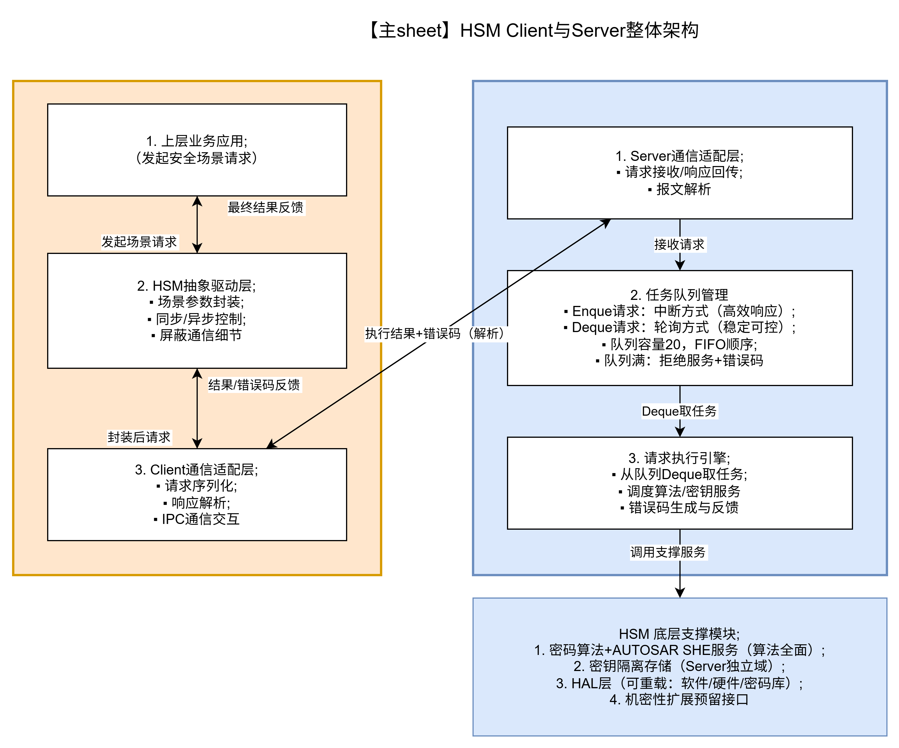

## HSM整体架构

整体采用 Client-Server架构, 如下图:

## 需求和设计原则
1. Client-Server通信：
    - Client发起HSM请求、等待结果；
    - Server执行HSM任务、反馈结果;
2. 队列规则：
    - 容量20，FIFO顺序，队列满拒绝服务并返回对应错误码;
3. Client驱动：
    - 封装功能服务参数，支持同步等待/异步获取结果，屏蔽通信细节;
4. HSM内部：
    - Enque/Deque/执行机制明确，支持硬件/软件/密码库重载;
5. 算法支持：
    - Autosar SHE、Hash/AES等全需求算法，密钥于Server隔离存储;
6. 错误码：
    - 精准对应各逻辑异常，全局统一分发

## 子架构图( Server端 )

## 子架构图( Client端 )
