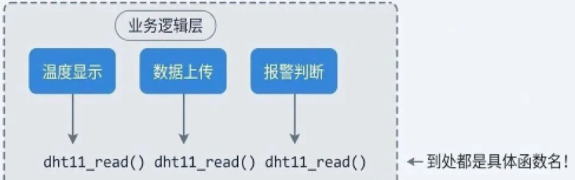
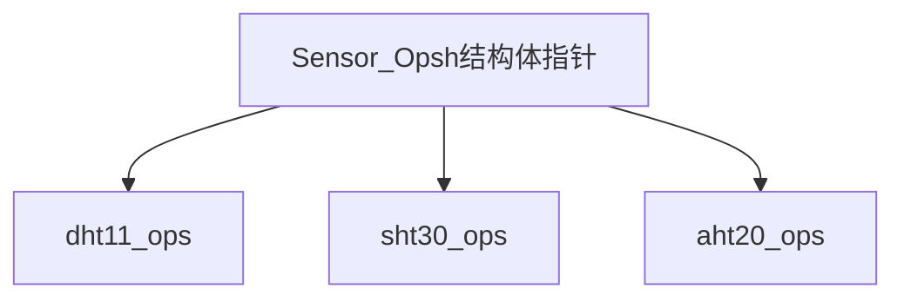

# C语言工厂模式
{: .no_toc }

## Table of contents
{: .no_toc .text-delta }

1. TOC
{:toc}

## 痛，太痛了，一换芯片就痛，为啥？
为什么换个传感器这么痛苦？
因为你的业务逻辑和底层驱动"焊死"在一起了。


### 强耦合的后果（到处是粑粑）
	
|   问题   |             表现              |
| -------- | ----------------------------- |
| 换芯片   | 全局搜索替换，漏改一个就是 Bug |
| 多型号   | #ifdef 满天飞，代码变"屎山"    |
| 单元测试 | 没硬件就没法测，只能上板调试    |

### 搞抽象一点还能救
如果代码能写成这样呢？
```c
// 业务层只认识 "sensor"，不认识具体是啥传感器
sensor->read_temp();  // 底层换成啥都不用改！
```
这就是工厂模式的魅力。

### 类（利用函数指针将实现下沉）

C 语言确实没有 class 关键字，但我们有 struct（结构体）。
	`结构体 + 函数指针 `= 丐版的类。
	
在 C 语言里，我们用包含函数指针的结构体来模拟接口： 
```c
/* sensor_interface.h - 传感器接口定义 */

typedef struct {
	const char *name;           // 传感器名称
	void (*init)(void);            // 初始化函数
	int  (*read_temp)(void);    // 读取温度
	int  (*read_humi)(void);    // 读取湿度
} Sensor_Ops; 
```
这个 Sensor_Ops 就是我们的"接口"：
	• 所有传感器都必须提供 `init、read_temp、read_humi `这三个函数
	• **上层业务只依赖这个结构体**，不关心具体是哪款传感器
	
### 类名统一，实例各自实现

每个传感器驱动只需要"填充"这个结构体：
```c
/* dht11.c - DHT11 驱动实现 */
static void dht11_init(void) {
	// DHT11 初始化：配置 GPIO，发送起始信号...
	printf("DHT11 初始化完成\n");
}

static int dht11_read_temp(void) {
	// 读取 DHT11 温度数据
	return 25;  // 示例返回值
}

static int dht11_read_humi(void) {
	// 读取 DHT11 湿度数据
	return 60;
}

// 导出操作集 —— 这就是"实例化接口"
const Sensor_Ops dht11_ops = {
	.name      = "DHT11",
	.init      = dht11_init,
	.read_temp = dht11_read_temp,
	.read_humi = dht11_read_humi,
}; 
```

同样，SHT30 也实现一份：
```c
/* sht30.c - SHT30 驱动实现 */

static void sht30_init(void) {
	// SHT30 初始化：I2C 配置，软复位...
	printf("SHT30 初始化完成\n");
}

static int sht30_read_temp(void) {
	// 通过 I2C 读取 SHT30 温度
	return 26;
}

static int sht30_read_humi(void) {
	return 55;
}

const Sensor_Ops sht30_ops = {
	.name      = "SHT30",
	.init      = sht30_init,
	.read_temp = sht30_read_temp,
	.read_humi = sht30_read_humi,
}; 
```

关键点：业务层只需要一个 Sensor_Ops * 指针，不需要知道它具体指向谁！

## 工厂函数（依type参数造具体实例）
```c
/* sensor_factory.c - 传感器工厂 */

#include "sensor_interface.h"

// 外部声明各个驱动的操作集
extern const Sensor_Ops dht11_ops;
extern const Sensor_Ops sht30_ops;
extern const Sensor_Ops aht20_ops;

// 传感器类型枚举
typedef enum {
    SENSOR_DHT11 = 0,
    SENSOR_SHT30,
    SENSOR_AHT20,
    SENSOR_MAX
} Sensor_Type;

// 工厂函数：根据类型返回对应的操作集
const Sensor_Ops* Sensor_GetOps(Sensor_Type type) {
    switch (type) {
        case SENSOR_DHT11:
            return &dht11_ops;
        case SENSOR_SHT30:
            return &sht30_ops;
        case SENSOR_AHT20:
            return &aht20_ops;
        default:
            return NULL;
    }
}
```

### 业务层有了工厂后，逻辑不耦合硬件了
```c
/* main.c - 业务逻辑 */

#include "sensor_interface.h"
#include "sensor_factory.h"

// 只需要改这一行！！！
#define CURRENT_SENSOR  SENSOR_SHT30

int main(void) {
    // 从工厂获取传感器
    const Sensor_Ops *sensor = Sensor_GetOps(CURRENT_SENSOR);

    if (sensor == NULL) {
        printf("错误：未知的传感器类型\n");
        return -1;
    }

    // 业务逻辑 —— 完全不关心具体是哪个传感器！
    sensor->init();

    while (1) {
        int temp = sensor->read_temp();
        int humi = sensor->read_humi();

        printf("[%s] 温度: %d°C, 湿度: %d%%\n",
               sensor->name, temp, humi);

        // 报警逻辑
        if (temp > 35) {
            printf("警告：温度过高！\n");
        }

        delay_ms(1000);
    }
}
```

老板："DHT11 断货了，换 SHT30！"你：改一行宏定义，编译，下载，收工。
```c
// 改这里
#define CURRENT_SENSOR  SENSOR_SHT30  // 之前是 SENSOR_DHT11
```

这个方案已经比"裸奔"强太多了，但它仍有痛点：

|   问题   |            表现            |
| ------ | ------------------------ |
| 违反开闭原则 | 每新增一个传感器，必须改工厂函数的 switch    |
| 集中依赖   | 工厂函数要 extern 所有驱动的 ops，耦合度还是高 |
| 无法动态扩展 | 想在运行时"发现"有哪些传感器？做不到       |


> 开闭原则 是面向对象设计的核心理念之一，其核心主张是：软件实体（如类、模块、函数）应该对扩展开放，但对修改关闭。这意味着当系统需要增加新功能时，应通过添加新的代码来实现，而不是修改已经稳定运行的现有代码 

有没有一种方法，写完驱动文件，工厂就能**自动识别到它，完全不用改工厂代码**？
有！这就是接下来要讲的"自动注册工厂模式"。

## 自动注册工厂模式
实现的效果是：写完驱动文件，编译链接后，工厂自动就能找到它，无需修改任何其他代码。

秘密在于链接器（Linker）。

编译器和链接器允许我们把变量放到指定的内存段（Section）。如果我们把所有传感器的 ops 结构体都放到同一个段，那工厂只需要遍历这个段就能找到所有传感器！
```txt
┌─────────────────── Flash 内存布局 ───────────────────┐
│                                                      │
│   .text  (代码段)                                    │
│   .rodata (只读数据)                                 │
│   ...                                                │
│                                                      │
│   ┌──────────────────────────────────────────────┐  │
│   │          .sensor_registry (自定义段)          │  │
│   │  ┌──────────┬──────────┬──────────┐          │  │
│   │  │ dht11_ops│ sht30_ops│ aht20_ops│  ...     │  │
│   │  └──────────┴──────────┴──────────┘          │  │
│   │  ↑                                    ↑      │  │
│   │  __sensor_start              __sensor_end    │  │
│   └──────────────────────────────────────────────┘  │
│                                                      │
│   .data (初始化数据)                                 │
│   .bss  (未初始化数据)                               │
│                                                      │
└──────────────────────────────────────────────────────┘
```

### 步骤一：定义注册宏（GCC 版）
```c
/* sensor_registry.h - 自动注册框架 */

#ifndef __SENSOR_REGISTRY_H__
#define __SENSOR_REGISTRY_H__

#include "sensor_interface.h"

// 魔法宏：把 ops 放到指定的内存段
#define REGISTER_SENSOR(sensor_ops)                          \
    __attribute__((used, section(".sensor_registry")))       \
    static const Sensor_Ops* __sensor_##sensor_ops = &sensor_ops

// 段起始和结束标记（由链接器生成）
extern const Sensor_Ops* __start_sensor_registry;
extern const Sensor_Ops* __stop_sensor_registry;

#endif
```

关键解释：
• __attribute__((section(".sensor_registry")))：告诉编译器把这个变量放到名为 .sensor_registry 的段
• __attribute__((used))：防止编译器优化掉这个"看起来没用"的变量
• __start_xxx 和 __stop_xxx：GCC 链接器会自动为每个自定义段生成这两个符号

### 步骤二：驱动文件使用注册宏
```c
/* dht11.c - DHT11 驱动 */

#include "sensor_interface.h"
#include "sensor_registry.h"

static void dht11_init(void) {
    printf("DHT11 初始化\n");
}

static int dht11_read_temp(void) {
    return 25;
}

static int dht11_read_humi(void) {
    return 60;
}

// 定义操作集
const Sensor_Ops dht11_ops = {
    .name      = "DHT11",
    .init      = dht11_init,
    .read_temp = dht11_read_temp,
    .read_humi = dht11_read_humi,
};

// 一行代码完成注册！
REGISTER_SENSOR(dht11_ops);
```
新增一个 SHT30？只管新增驱动文件，最后加一行 REGISTER_SENSOR(sht30_ops);，完事！

### 步骤三：工厂函数遍历注册表
```c
/* sensor_factory.c - 新版工厂（完全不用改！）*/

#include "sensor_registry.h"

// 根据名字查找传感器
const Sensor_Ops* Sensor_Find(const char *name) {
    // 遍历 .sensor_registry 段
    const Sensor_Ops **ptr;

    for (ptr = &__start_sensor_registry;
         ptr < &__stop_sensor_registry;
         ptr++) {
        if (strcmp((*ptr)->name, name) == 0) {
            return *ptr;
        }
    }
    return NULL;
}

// 获取已注册的传感器数量
int Sensor_GetCount(void) {
    return &__stop_sensor_registry - &__start_sensor_registry;
}

// 遍历所有传感器
void Sensor_PrintAll(void) {
    const Sensor_Ops **ptr;

    printf("已注册的传感器列表：\n");
    for (ptr = &__start_sensor_registry;
         ptr < &__stop_sensor_registry;
         ptr++) {
        printf("  - %s\n", (*ptr)->name);
    }
}
```


### 此时的业务层
```c
/* main.c */

#include "sensor_registry.h"

int main(void) {
    // 打印所有已注册的传感器
    printf("系统共注册了 %d 个传感器\n", Sensor_GetCount());
    Sensor_PrintAll();

    // 按名字获取传感器
    const Sensor_Ops *sensor = Sensor_Find("SHT30");
    if (sensor) {
        sensor->init();
        printf("温度: %d°C\n", sensor->read_temp());
    }

    return 0;
}
```
```txt
运行结果：系统共注册了 3 个传感器
已注册的传感器列表：
  - DHT11
  - SHT30
  - AHT20
SHT30 初始化
温度: 26°C
```
### 此架构下新增传感器
现在新增一个 AHT20 传感器，你需要做什么？
1. 新建 aht20.c 文件
2. 实现 aht20_ops 结构体
3. 文件末尾加一行 REGISTER_SENSOR(aht20_ops);
4. 编译

**工厂代码？不用动！**
**枚举定义？不用加！**
**头文件依赖？不用改！**
这就是"开闭原则"的完美体现：对扩展开放，对修改关闭。

总结：
    1. 编译每个驱动文件的 REGISTER_SENSOR 宏生成一个指针变量
    2. 链接链接器把所有带 section 属性的变量收集到同一段
    3. 运行工厂函数遍历这个段，就能找到所有注册的传感器


## 工厂模式的实际好处
### 硬件模拟Mock
你是否有过这样的经历：
- 硬件还没回来，但老板催着要进度
- 传感器只有一个，几个人轮流用
- 想写单元测试，但没法脱离硬件

工厂模式的解法：写一个 Mock 传感器！

```c
/* mock_sensor.c - 模拟传感器（用于测试和开发） */

static int mock_temp = 25;  // 可配置的假数据

static void mock_init(void) {
    printf("[Mock] 传感器初始化\n");
}

static int mock_read_temp(void) {
    return mock_temp;
}

static int mock_read_humi(void) {
    return 50;
}

// 提供接口修改假数据（用于测试边界条件）
void Mock_SetTemp(int temp) {
    mock_temp = temp;
}

const Sensor_Ops mock_sensor_ops = {
    .name      = "MockSensor",
    .init      = mock_init,
    .read_temp = mock_read_temp,
    .read_humi = mock_read_humi,
};

REGISTER_SENSOR(mock_sensor_ops);
```

现在你可以：

- 在 PC 上调试业务逻辑：切换到 Mock 传感器，完全不需要硬件
- 写单元测试：用 Mock_SetTemp(100) 模拟高温报警场景
- 测试边界条件：-40°C？150°C？想测什么测什么

```c
// 单元测试示例
void test_high_temp_alarm(void) {
    const Sensor_Ops *sensor = Sensor_Find("MockSensor");

    // 设置假温度为 100°C
    Mock_SetTemp(100);

    int temp = sensor->read_temp();
    assert(temp == 100);

    // 验证报警逻辑被触发
    assert(alarm_triggered == true);

    printf("高温报警测试通过！\n");
}
```

### 多版本兼容,一套代码走四方
公司产品线：
• Pro 版：用高精度 SHT30，贵但准
• Lite 版：用便宜的 DHT11，性价比高
• 工业版：用 PT100，-200°C 到 850°C

传统方案？三套代码库，维护到怀疑人生。工厂模式方案？**一套代码，编译时选择**：
```c
// 通过宏控制编译哪些驱动
#ifdef PRODUCT_PRO
    #include "sht30.c"      // Pro 版包含 SHT30 驱动
#endif

#ifdef PRODUCT_LITE
    #include "dht11.c"      // Lite 版包含 DHT11 驱动
#endif

#ifdef PRODUCT_INDUSTRIAL
    #include "pt100.c"      // 工业版包含 PT100 驱动
#endif
```

或者更优雅：运行时动态选择：
```c
const Sensor_Ops* get_sensor_by_hw_version(void) {
    uint8_t hw_ver = read_hw_version_from_eeprom();

    switch (hw_ver) {
        case HW_VER_PRO:
            return Sensor_Find("SHT30");
        case HW_VER_LITE:
            return Sensor_Find("DHT11");
        case HW_VER_INDUSTRIAL:
            return Sensor_Find("PT100");
        default:
            return Sensor_Find("MockSensor");  // 降级方案
    }
}
```

### 团队协作：各写各的，互不干扰
在大型项目中：
- 小王负责 DHT11 驱动
- 小李负责 SHT30 驱动
- 小张负责业务逻辑

传统模式下，三个人的代码互相依赖，改一个文件可能影响全部。

工厂模式下：
- 小王只管 dht11.c，实现好接口，注册完就行
- 小李只管 sht30.c，同上
- 小张只依赖 Sensor_Ops 接口，根本不用看驱动代码合并代码零冲突！

### 工厂模式适用场景

适用场景工厂模式特别适合这些场景：
- 同一类外设有多种选型（传感器、存储、显示屏等）
- 产品有多个硬件版本
- 需要支持硬件 Mock 做单元测试
- 团队协作开发

驱动层工厂模式不适合这些场景：
- 外设永远只有一种，不会变
- 项目极小，过度设计反而增加复杂度
-  对代码大小极度敏感（函数指针会略增开销）

