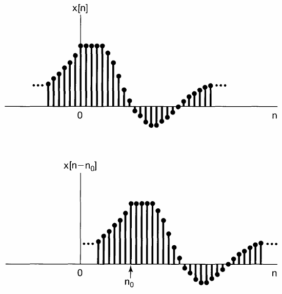
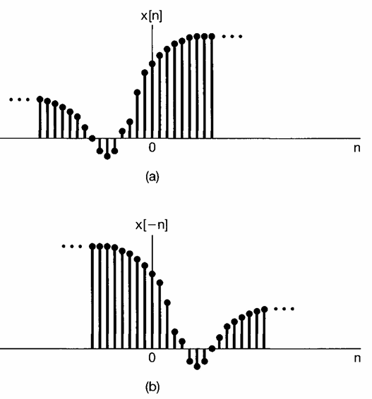
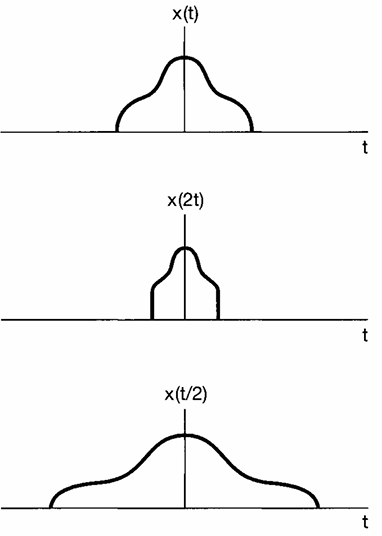
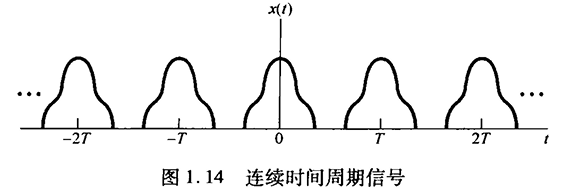
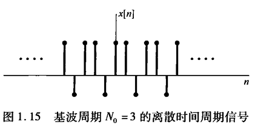

## 第一章 信号与系统
### 1.1 连续时间信号与离散时间信号
- 连续时间信号：自变量为连续时间的信号
- 离散时间信号：自变量仅仅取在离散值上的信号

1.1.2 信号能量与功率
- 瞬时功率：在时间t点的功率值 
$$
p(t) = v(t)i(t) = \frac{1}{R} v^2(t)
$$
- 在时间间隔 $$ [t_1, t_2] $$ 内的总能量 
$$
\int_{t_1}^{t_2} p(t) dt = \int_{t_1}^{t_2} \frac{1}{R} v^2(t) dt
$$
- 平均功率：在时间间隔 $$ [t_1, t_2] $$ 内的平均功率 
$$
\frac{1}{t_2 - t_1} \int_{t_1}^{t_2} p(t) dt = \frac{1}{t_2 - t_1} \int_{t_1}^{t_2} \frac{1}{R} v^2(t) dt
$$

若是把信号看成复数x(t), 则t1到t2之间的总能量为 
$$ \int_{t_1}^{t_2} |x(t)|^2 dt $$
，其中 
$$ |x(t)| $$
记为信号x(t)的模，总能量除以时间间隔 
$$ t_2 - t_1 $$
即为平均功率。

类似的，离散信号而言：在n1到n2之间的总能量为 
$$ \sum_{n_1}^{n_2} |x(n)|^2 $$
，其中 
$$ |x(n)| $$
记为信号x(n)的模，总能量除以时间间隔 $$ n_2 - n_1 + 1 $$ 即为平均功率。

> Note：这里的功率与能量，与是否真正关联了物理量没有关系。只是在信号处理中，我们通常把信号看成复数，而复数的模平方就是信号的能量。

很多时候，系统的关心TT是信号在一个无穷大的时间间隔内的总TT量与平均功率。这样:
- 连续信号的总能量为：
$$
lim_{T \to \infty} \int_{-T}^{T} |x(t)|^2 dt = \int_{-\infty}^\infty |x(t)|^2 dt
$$

- 连续信号的平均功率为：
$$
lim_{T \to \infty} \frac{1}{2T} \int_{-T}^{T} |x(t)|^2 dt
$$

- 离散信号的总能量为：
$$
lim_{N \to \infty} \sum_{n=-N}^{N} |x(n)|^2 = \sum_{-\infty}^\infty |x(n)|^2
$$

- 离散信号的平均功率为：
$$
lim_{N \to \infty} \frac{1}{2N+1} \sum_{n=-N}^{N} |x(n)|^2
$$

以上的定义可以区分出三种信号：
- 有限能量信号(平均功率为0)
- 有限功率信号(平均功率为有限值,能量为无限)
- 无限功率且无限能量信号，一个例子就是x(t) = t

### 1.2 自变量变换

**三种自变量变换：**
- 时移 $$x[n] -> x[n - n_0]$$

- 时间反转 $$x[n] -> x[-n]$$

- 时间尺度变换 $$x[t] -> x[a*t]$$ 

**周期信号：**
存在一个正数T，使得 $$x(t) = x(t + T)$$。
周期为T，那么x(t)对于2T,3T,4T等也是周期的,使得上式成立的最小正值T为**基波周期(fundamental period)**

离散信号而言，周期信号的定义为：
存在一个正数N，使得 $$x(n) = x(n + N)$$。
周期为N，那么x(n)对于2N,3N,4N等也是周期的,使得上式成立的最小正值N为**基波周期(fundamental period)**

### 偶信号和奇信号

偶信号：$$x(-n) = x(n)$$

奇信号：$$x(n) = -x(n)$$

**任何信号都可以分解为偶信号和奇信号的和**
$$Ev{x(t)} = 1/2(x(t) + x(-t))$$

$$Od{x(t)} = 1/2(x(t) - x(-t))$$

Ev和Od分别被称为x(t)的偶部和奇部。

## 指数信号与正弦信号
**连续时间复指数信号**
$$x(t) = C e^{at}$$

若C和a都是实数，那么x(t)是一个实指数信号。
- a为正时，信号增长；a为负时，信号衰减。
若a为0，那么信号为常量。

**周期复指数信号与正弦信号**
若a是纯虚数，例如 $$ a = j\omega_0 $$, 则 
$$
x(t) = e^{j\omega_0 t} \tag{1.21}
$$，
这是一个周期信号。基波周期为
$$
T_0 = 2\pi/|\omega_0| \tag{1.24}
$$

与周期复指数信号密切相关的是正弦信号
$$
x(t) = A \cos(\omega_0 t + \phi) \tag{1.25}
$$
> $$\omega_0$$的单位是rad/s，$$\phi$$的单位是rad。$$f_0$$是频率,$$\omega_0$$角频率为$$2\pi*f_0$$。

**欧拉关系**：
欧拉公式表示：复指数信号可以用频率与其相同的正弦信号表示。
即
$$
e^{j\theta} = \cos\theta + j\sin\theta \\
e^{j\omega_0 t} = \cos(\omega_0 t) + j\sin(\omega_0 t) \tag{1.26}
$$

同时，正弦信号也能用频率与之相同的复指数信号表示。
$$
\begin{array}{l}
x(t) &=& A \cos(\omega_0 t + \phi) \\
&=& \frac{A}{2} e^{j\omega_0 t + j\phi} + \frac{A}{2} e^{-j\omega_0 t - j\phi} \\
&=& \frac{A}{2} *e^{j\phi}* e^{j\omega_0 t} + \frac{A}{2}*e^{-j\phi}* e^{-j\omega_0 t} \tag{1.27} \\
\end{array}
$$
注意，式(1.27)中的两个指数信号都有复数振幅，

另外的方式, 正弦信号还可以用复指数信号表示为：
$$
\cos(\omega_0 t + \phi) = A\operatorname{Re}\left\{e^{j(\omega_0 t + \phi)}\right\} \tag{1.28}
$$
$$
A\sin(\omega_0 t + \phi) = A\operatorname{Im}\left\{e^{j(\omega_0 t + \phi)}\right\} \tag{1.29}
$$ 

**补充说明**
- $\operatorname{Re}\{\cdot\}$ 是取复数实部的算子，$\operatorname{Im}\{\cdot\}$ 是取复数虚部的算子
- 该式是信号与系统中**正弦信号的复指数表示**，核心基于欧拉公式 $e^{j\theta} = \cos\theta + j\sin\theta$，通过取实部/虚部还原实正弦信号，是傅里叶分析的基础工具之一。

从式(1.24)可以看到，连续时间正弦信号或一个周期复指数信号，其基波周期 $$T_0$$ 是与 $$|\omega_0|$$ 成反比的，也称 $$\omega_0$$ 为 **基波频率(fundamental frequency)**。

周期信号，尤其是式(1.21)的复指数信号和式(1.25)的正弦信号，给出了具有无限能量但有有限平均功率的这类信号的例子。例如，考虑式(1.21)的周期复指数信号，假设在一个周期内计算该信号的总能量和平均功率：
$$
E_{\text{period}} = \int_{0}^{T_0} \left| e^{j\omega_0 t} \right|^2 \mathrm{d}t = \int_{0}^{T_0} 1 \cdot \mathrm{d}t = T_0 \tag{1.30}
$$
$$
P_{\text{period}} = \frac{1}{T_0} E_{\text{period}} = 1 \tag{1.31}
$$

因为随着 $t$ 从 $-\infty$ 到 $+\infty$，有无穷多个周期，所以在全部时间内积分的总能量就是无限大。该信号的每个周期都完全一样，因为在每个周期内信号的平均功率等于1，所以在多个周期上平均也总是得到1的平均功率。这就是说，周期复指数信号具有有限平均功率，等于
$$
P_{\infty} = \lim_{T \to \infty} \frac{1}{2T} \int_{-T}^{T} \left| e^{j\omega_0 t} \right|^2 \mathrm{d}t = 1 \tag{1.32}
$$
