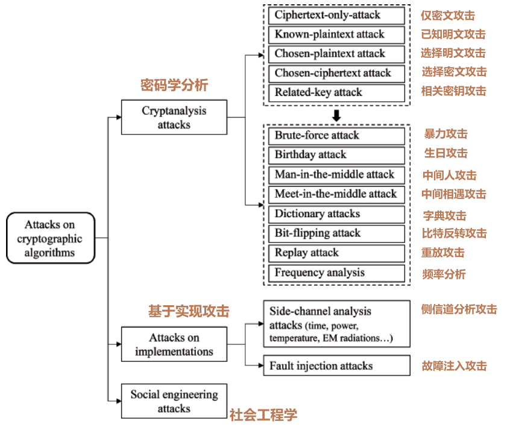

# Attacks against Cryptographic Algorithms
{: .no_toc }

## Table of contents
{: .no_toc .text-delta }

1. TOC
{:toc}

在[密码学原语](./cryptographic-primitives)与[密码算法基本属性](./fundamental-properties)中，我们介绍了

网络攻击类型，包括钓鱼攻击、垃圾邮件攻击、分布式拒绝服务攻击以及勒索攻击。

这类攻击的主要目的是
**窃取敏感个人数据、封锁系统访问权限、威胁私人生活安全以及索要赎金。**

绝大多数此类攻击
会利用三类漏洞实施：
用户的轻信、鲁莽与贪婪心理，
操作系统自身存在的缺陷，
以及网络具备的信息传播与扩散能力。

发起这类攻击的网络犯罪分子，通常并非密码分析专业人员。

本节所探讨的攻击
针对的是`密码算法自身的安全弱点`，其主要目标包括：
- 已拿到密文,破解`获取`与其对应的一条或多条`明文`。
- 在不掌握密钥key的情况下`伪造认证Tag`或`数字签名`。
- 破解`还原`用于加密、消息认证码计算或数字签名的`密钥`。
- `推导`密码算法的部分`内部状态`（例如分组密码中的单轮密钥、流密码中的一段密钥流片段）。

可延展性(Malleability)指能够将一份`密文篡改生成另一份不同密文`，使接收方解密后得到全新且`有异于原始内容的明文`。

同时，可延展性也指`篡改相关数据后仍能生成相同的认证标签或签名`，
致使接收方误认数据真实可信，而实际上数据已被篡改。可延展性通常属于密码算法的`不良安全特性`。
例如，比特翻转攻击就是利用流密码的`可延展性漏洞`发起的。

针对密码算法的攻击由密码分析人员设计并实施。这类攻击会利用
算法设计缺陷、代码实现漏洞以及使用方式上的疏漏。
攻击者尤其会借助社交网络，挖掘目标个人或机构的各类有效信息。
例如，攻击者可从用户社交对话中推断出加密明文的部分内容（如人名、问候语、聊天话题等），
再利用这些推断出的信息，进一步挖掘目标人员的更多隐私信息。

## Cryptanalysis

密码分析被视为密码学的对立面，它是一门**破解密码算法**的科学与技术。学术领域的**密码分析师**、欧美等国家的**国家安全机构密码分析人员**以及**网络恐怖分子**，都深度涉足这一领域。现代密码学诞生以来，各国政府都会配备专职人员、聘请密码破译服务机构，开展加密技术研究与密码破解工作。战争与情报间谍活动（涵盖工业、农业、医疗、金融、政治等诸多领域）一直是推动密码分析技术发展的主要动因。

密码分析需要依托加密算法的设计细节知识（尤其是民用场景所用算法通常属于公开信息），同时还要掌握明文的结构特征（例如网上银行交易报文、行政公文的文本结构等）。密码分析的效率，主要取决于攻击者可调用的**算力资源**、**可获取的明文样本以及密文数据量**。

