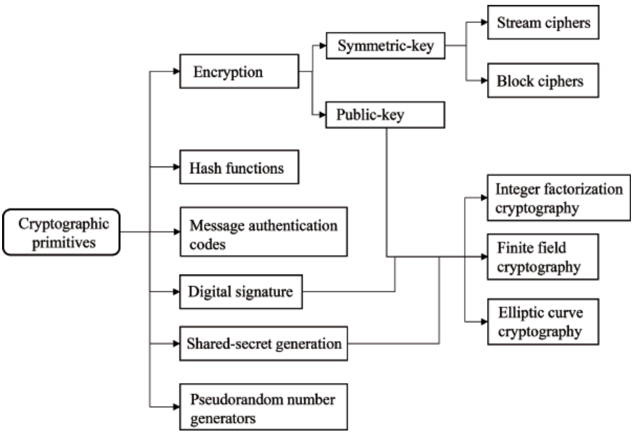
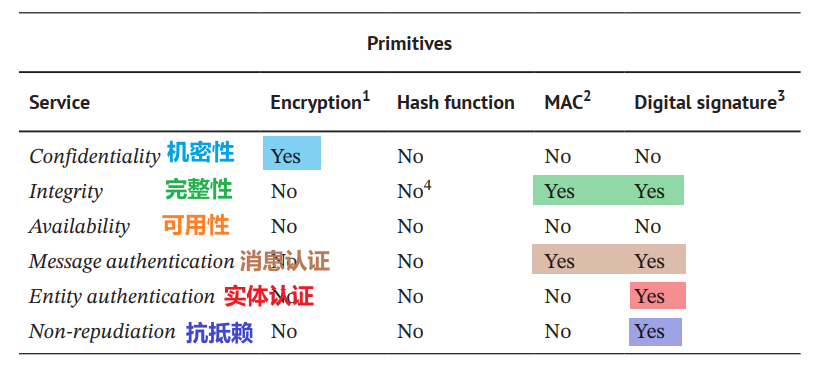

## 密码学原语
它是一种**用于构建**计算机安全系统的**基本加密算法**。

数千年来，密码学一直致力于保护信息和数据的机密性。今天的密码学不仅仅是加密和解密。数据完整性、身份验证、数字签名和不可否认性是密码学提供的安全服务。常见的加密原语可分为六类:
- **Encryption/decryption primitives** （加密/解密）
- **Hash functions**  (哈希)
- **Message authentication codes**  （MAC消息认证码）
- **Digital signatures** (签名)
- **Shared-secret generation** (秘密共享)
- **Pseudorandom number generation** (PRNG伪随机数生成)

## 加密原语
加密原语的主要目的是确保**机密性**。
加扰数据使不知道解密密钥的人无法使用（即看起来像噪音）。
对称密码有两个家族：分组密码和流密码

- 分组密码：

- **流密码**：
`流密码`是一类`逐比特（一次处理一个比特）`利用`密钥流对明文进行加密`的加密算法。
设 $$P$$ 为明文， $$S$$ 为密钥流（与明文长度相同），则密文 $$C$$ 的定义为 $$C=P\oplus S$$ ，其中 $\oplus$ 为按位异或运算符。反之，明文可由 \(P=C\oplus S\) 求得。因此，`加密和解密是完全相同的运算`。总体而言，`流密码的运算速度远快于分组密码`。
