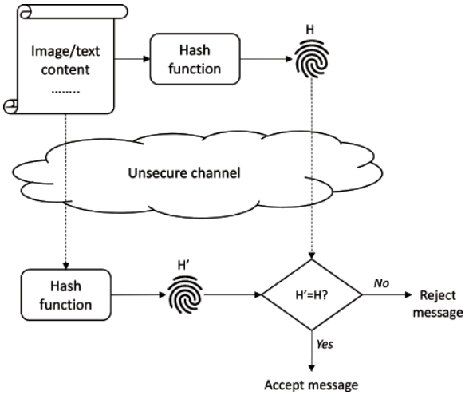

## 密码学原语
它是一种**用于构建**计算机安全系统的**基本加密算法**。

数千年来，密码学一直致力于保护信息和数据的机密性。今天的密码学不仅仅是加密和解密。数据完整性、身份验证、数字签名和不可否认性是密码学提供的安全服务。常见的加密原语可分为六类:
- **Encryption/decryption primitives** （加密/解密）
- **Hash functions**  (哈希)
- **Message authentication codes**  （MAC消息认证码）
- **Digital signatures** (签名)
- **Shared-secret generation** (秘密共享)
- **Pseudorandom number generation** (PRNG伪随机数生成)

## 加密原语(Encryption)
加密原语的主要目的是确保**机密性**。
加扰数据使不知道解密密钥的人无法使用（即看起来像噪音）。
对称密码有两个家族：分组密码和流密码

- **分组密码(Block Ciphers)**：
    - 块(Block)密码: 加密/解密`固定大小（例如128位）`的明文（称为块）的加密算法。
    - 加密（或解密）操作以一系列连续轮的形式工作。每一轮都使用其输入片段（初始明文、密钥和前一轮的输出）的替换和排列。
    - 通常，解密操作以与加密相反的顺序执行替换和置换操作。两种最著名和最常用的分组密码是DES和AES。为了加密长度超过单个块的明文，使用`操作模式将明文拆分为Block`，然后调用块密码来加密每个块。密文和明文块可以组合在一起以防止某些攻击

- **流密码(Stream Ciphers)**：
`流密码`是一类`逐比特（一次处理一个比特）`利用`密钥流对明文进行加密`的加密算法。
设 $P$ 为明文， \(S\) 为密钥流（与明文长度相同），则密文 \(C\) 的定义为 $C=P\oplus S$ ，其中 $\oplus$ 为按位异或运算符。反之，明文可由 \(P=C\oplus S\) 求得。因此，`加密和解密是完全相同的运算`。总体而言，`流密码的运算速度远快于分组密码`。

- **公钥加密算法(Public-key Encryption Algorithms )**
主要包括`RSA、ElGamal和ECIES`（Elliptic Curve Integrated Encryption Scheme）密码系统

## Hash与数据完整性
加密提供了关于机密性的保证。然而，仅靠加密无法防止密文的更改（即添加、删除或修改比特），这会导致解密的明文与原始明文不同。为了保护数据的完整性，使用称为哈希函数的单向函数来生成`数字指纹(fingerprints)`，也称为`摘要(digests)`或`标签(tags)`。
- 哈希函数接收可变长度的数据（可能为数百GB），并`生成固定长度的摘要`（几百位）。
- 数据及其标签一起存储或发送。

为了检查数据的完整性，接收方计算接收到的数据摘要，并将其与接收到的标签进行比较。如果两个标签相同，则收件人接受收到的数据。否则，数据将被拒绝。

哈希函数的几个基本属性是：
1. 如果一个或几个数据位发生了变化，就会产生一个完全不同的标签(`雪崩`)
2. `抗原象性`：如果知道一个数据的标签，不能基于这个标签来推断原始数据。
3. 如果一个人知道与数据相关联的标签，他/她就找不到映射到同一标签的另一个数据(`抗第二原象性`)；这就是为什么在密码学中使用指纹这一术语

## MAC消息认证码
消息认证码（MAC）算法是用于提供消息源认证和完整性的密码算法。它们产生身份验证标签(Tag)，也称为MAC。一般来说，MAC可以通过以下方式生成：
- 依赖于`哈希函数和密钥`的算法；这就是为什么它们被称为哈希MAC（或`HMAC`）或密钥哈希函数。数据和密钥被散列在一起以产生MAC，然后与数据一起存储或传输。 
- `基于流密码`的算法，其中内部密码寄存器的最终状态包含MAC。 
- `基于块密码`的算法，其中数据逐块加密，每个块的密文用于加密下一个块。最后一个块的加密表示MAC。

发送方使用数据保护和与接收方共享的密钥生成MAC。在接收到一对（数据，MAC）时，接收方使用接收到的数据和共享密钥计算MAC，然后将其与接收到的MAC进行比较。如果两者相等，则接收方得出结论，接收到的数据没有被更改（即完整性验证）--- `Tag证明完整性`，并且是由共享密钥的实体发送的（即源身份验证） --- `密钥证明身份`
