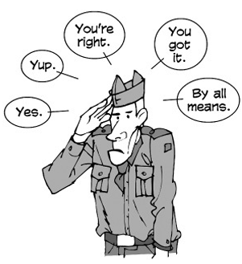
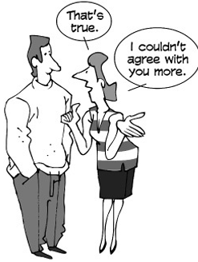
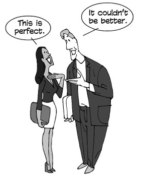
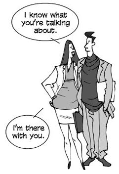
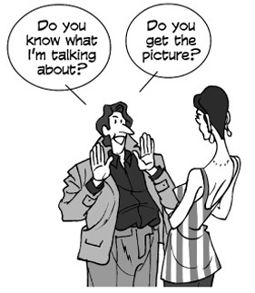

---
title: Agreeing
parent: American-English-Expression
--- 

# Agreeing
{: .no_toc }

## Table of contents
{: .no_toc .text-delta }

1. TOC
{:toc}

## 28	Simple	agreement

Yes.

Yeah.	(informal)

Yep.	(informal)

Yup.	(informal)

Right.

You’re	right.

Right	you	are.

Right	on!

Right-o.

Uh-huh.

Sure.

Sure	thing.

You	got	it.

You	bet.

Absolutely.

By	all	means.

## 29	Stating	your	concurrence
This	is	true.

That’s	true.

That’s	true.

You’re	right.

Ain’t	that	the	truth?

Ain’t	it	the	truth?

That’s	right.

That’s	for	certain.

That’s	for	sure.

That’s	for	darn	sure.

That’s	for	damn	sure.	(mildly	vulgar)	Damn	straight!	(mildly	vulgar)	It	works for	me.

Well	said.

I	agree.

I	agree	with	you	100	percent.

I	couldn’t	agree	with	you	more.

I	have	no	problem	with	that.

We	see	eye	to	eye	on	this.

I	couldn’t	have	said	it	better.

You	took	the	words	right	out	of	my	mouth.

I’ll	drink	to	that!

## 30	Expressing	acceptance

It’s	fine.

I	think	it’s	fine.

It’s	good	enough.

It’s	satisfactory.

It’ll	do.

It’ll	serve	the	purpose.

I	like	it.

I	love	it.

I	think	it’s	great.

I	like	the	color.

I	like	the	texture.

I	like	the	flavor.

It’s	got	a	good	rhythm.

It’s	wonderful.

It’s	fabulous.

It’s	ideal.

It’s	a	masterpiece.

It’s	perfect.

It’s	A-1.

This	is	second	to	none.

This	is	perfect.

This	is	far	and	away	the	best.

This	is	the	ultimate.

It	couldn’t	be	better.

Never	been	better.

There’s	none	better.

It	doesn’t	get	any	better	than	this.

I’ve	never	seen	anything	like	it.

This	is	the	cream	of	the	crop.	(cliché)	This	is	the	pick	of	the	litter.	(idiomatic)

> litter	=	a	group	of	newborn	pups

This	is	the	crême	de	la	crême.	(cliché)	=	This	is	the	best	of	the	best.

This	is	head	and	shoulders	above	the	rest.

That	suits	me	to	a	T.
> =	That	suits	me	fine.

That’s	the	ticket.	(idiomatic)	That’s	just	what	the	doctor	ordered.	(idiomatic)

That’s	just	what	I	needed.

That	hits	the	spot.	(idiomatic)	That	fits	the	bill.	(idiomatic)	That’s	it.

That’s	the	greatest	thing	since	sliced	bread.	(cliché)	It’s	in	a	league	of	its	own.

I	give	it	four	stars.

It	gets	two	thumbs	up.	(idiomatic)	I’ve	hit	the	jackpot.
> jackpot	=	sum	of	money	to	be	won	in	gambling

Bingo!	(slang)
> =	I	did	it!

Jackpot!	(slang)
> =	I	did	it!;	It	is	good!

Bull’s-eye!	(slang)	Bonus	score!	(slang)

## 31	Stating	that	you	understand

I	hear	you.

I	hear	you,	man.

I	hear	what	you’re	saying.

I	see	what	you’re	saying.

I	can	see	what	you’re	saying.

I	can	see	that.

I	see	what	you	mean.

I	see	where	you’re	coming	from.

I	know.

I	know	what	you	mean.

Point	well	taken.

I	know	what	you’re	talking	about.

I	understand	what	you’re	saying.

Understood.

I	dig	it.	(slang)

I	can	dig	it.	(slang)

I	got	you.

Gotcha.

(I)	got	it.

(I)	got	it.

I	follow	you.

I’m	with	you.

I’m	there	with	you.

I’ve	been	there.

Read	you	loud	and	clear.

Roger.

Roger,	wilco.

wilco	=	will	comply

Roger	Dodger.	(slang)

## 32	Making	sure	you	are	understood

Do	you	know	what	I	mean?

Do	you	know	what	I’m	talking	about?

Know	what	I	mean?

Does	that	make	any	sense?

Am	I	making	sense?

Are	you	following	me?

Know	what	I’m	saying?

You	know?

Do	you	see	what	I	mean?

Do	you	see	what	I	mean?

See	what	I	mean?

Don’t	you	see?

Do	you	get	the	message?

Do	you	get	the	picture?

Get	the	message?

Get	the	picture?

Get	my	drift?

Do	you	get	it?

Get	it?

Do	you	follow?

Do	you	follow	me?

Dig?	(slang)
> =	Do	you	understand?

Understand?

Do	you	understand?

Do	you	hear	what	I’m	saying?

Do	you	hear	me?

Do	you	see	where	I’m	coming	from?

where	I’m	coming	from	=	what	my	position	is

Do	you	agree?

You’re	with	me,	right?

Are	you	with	me	on	this?

Do	we	see	eye	to	eye	on	this?
