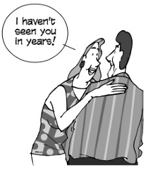

---
title: Basic-Social-Encounters
parent: American-English-Expression
--- 

# Basic Social Encounters
{: .no_toc }

## Table of contents
{: .no_toc .text-delta }

1. TOC
{:toc}

## 1    Simple    greetings

- Hi!
- Hello!
- Hello    there!
- Howdy!
- Hey!
- Yo! (slang)

## 2    General    greeting
- How    are    you?
- How’s    it    going?
- How’s    it    been?
- How    is    everything?
- How’s    everything?
- How    have    you    been?
- How    have    you    been?
- How’ve    you    been?
- How    you    been?    (informal)
- How’s    tricks?    (informal)
- What    have    you    been    up    to?
- What’s    new?    (informal)
- What’s    up?    (informal)
- Wusup?    /    Wassup?    (slang)
- What’s    happening?    (slang)    What’s    going    on?    (slang)

## 3    Greetings    for    various    times    of    the    day
- Good    morning.
- Morning.
- Mornin’.    (informal)
- How    are    you    this    bright    morning?
- Good    afternoon.
- Afternoon.
- Good    evening.
- Evening

## 4    Greeting    a    person    you    haven’t    seen    in    a    long    time

- I    haven’t    seen    you    in    years!
- Long    time    no    see!    (informal)    I    haven’t    seen    you    in    an    age!
- I    haven’t    seen    you    in    a    month  of    Sundays!
> a    month    of    Sundays    =    a    long    time

## 5    Welcoming    someone    who    has    returned
- Welcome    back!
- Welcome    back,    stranger!
- Long    time    no    see!    (cliché)    Where    were    you?
- Where    have    you    been?
- Where    did    you    go?

