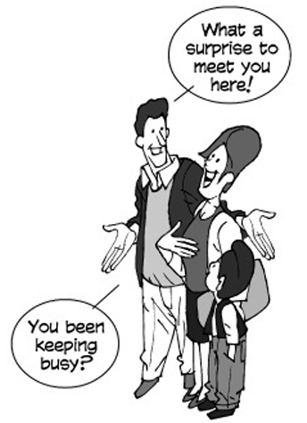

---
title: Basic-Social-Encounters
parent: American-English-Expression
--- 

# Basic Social Encounters
{: .no_toc }

## Table of contents
{: .no_toc .text-delta }

1. TOC
{:toc}

## 1    Simple    greetings

- Hi!
- Hello!
- Hello    there!
- Howdy!
- Hey!
- Yo! (slang)

## 2    General    greeting
- How    are    you?
- How’s    it    going?
- How’s    it    been?
- How    is    everything?
- How’s    everything?
- How    have    you    been?
- How    have    you    been?
- How’ve    you    been?
- How    you    been?    (informal)
- How’s    tricks?    (informal)
- What    have    you    been    up    to?
- What’s    new?    (informal)
- What’s    up?    (informal)
- Wusup?    /    Wassup?    (slang)
- What’s    happening?    (slang)    What’s    going    on?    (slang)

## 3    Greetings    for    various    times    of    the    day
- Good    morning.
- Morning.
- Mornin’.    (informal)
- How    are    you    this    bright    morning?
- Good    afternoon.
- Afternoon.
- Good    evening.
- Evening

## 4    Greeting    a    person    you    haven’t    seen    in    a    long    time

- I    haven’t    seen    you    in    years!
- Long    time    no    see!    (informal)    I    haven’t    seen    you    in    an    age!
- I    haven’t    seen    you    in    a    month  of    Sundays!
> a    month    of    Sundays    =    a    long    time

## 5    Welcoming    someone    who    has    returned
- Welcome    back!
- Welcome    back,    stranger!
- Long    time    no    see!    (cliché)    Where    were    you?
- Where    have    you    been?
- Where    did    you    go?

## 6	Expressing	surprise	at	meeting	someone

What	a	surprise	to	meet	you	here!

Imagine	meeting	you	here!	(cliché)	Fancy	meeting	you	here.	(cliché)	Never
thought	I’d	see	you	here!

What	are	you	doing	in	this	neck	of	the	woods?

neck	of	the	woods	=	part	of	town,	location

What	are	you	doing	in	this	part	of	town?

What	are	you	doing	out	of	the	office?

What	are	you	doing	out	of	the	office?

Where’ve	you	been	hiding	yourself?

What	have	you	been	up	to?

Shouldn’t	you	be	in	school?

Shouldn’t	you	be	at	work?

Have	you	been	keeping	busy?

You	been	keeping	busy?

Been	keeping	busy?

## 7	After	you	have	greeted	someone

We	seem	to	keep	running	into	each	other.

Haven’t	we	met	before?

We	have	to	stop	meeting	like	this.	(cliché)	Didn’t	we	meet	at	that	party	last  week?

I’m	sorry;	I’ve	forgotten	your	name.

I’ve	been	meaning	to	call	you.

## 8	Concerning	a	journey	or	 vacation

How	was	it?

How	did	it	go?

Did	everything	go	OK?

Did	you	have	fun?

You’ll	have	to	tell	us	all	about	it.

Did	you	take	any	pictures?

Do	you	have	pictures?

Were	the	locals	friendly?

Were	the	natives	friendly?

Did	you	bring	me	anything?

We	missed	you.

We	missed	you	around	here.

We’ve	missed	you	around	here.

It	just	wasn’t	the	same	without	you.

