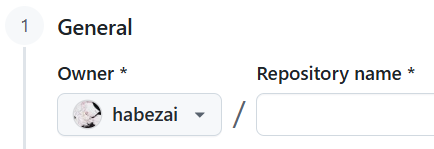
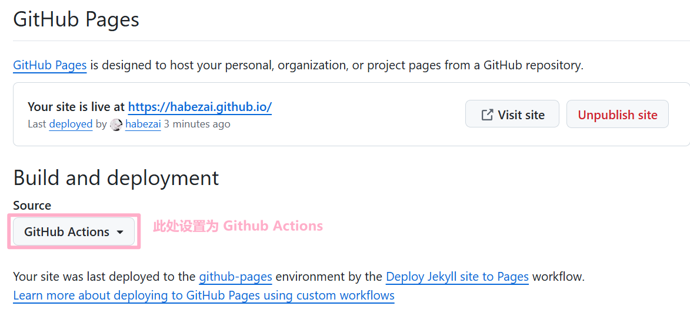

## 1.创建新站点
> To get started with creating a site, simply:
> 1.click ["use this template"](https://github.com/just-the-docs/just-the-docs-template/generate) to create a GitHub repository

点击链接，填写一个仓库名，然后点击Create即可。


## 2.发布新站点
> go to Settings > Pages > Build and deployment > Source, and select GitHub Actions




## 3.网站首页和配置修改

`index.md` 简单demo

```markdown
---
title: 首页
layout: home
---

正文替换为实际内容
```

`_config.yml` 除了主题固定采用just-the-docs，别的都可依据实际使用值进行自定义。

```markdown
title: Habezai's Knowledge Farm
description: A Knowledge Farm for Habezai!

theme: just-the-docs

url: https://habezai.github.io

aux_links:
  "本项目源码":
    - "https://github.com/habezai/habezai.github.io"  
  "在线演示":
    - "https://github.com/habezai"  
  "个人GitHub":
    - "https://github.com/habezai"  
```


