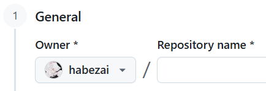
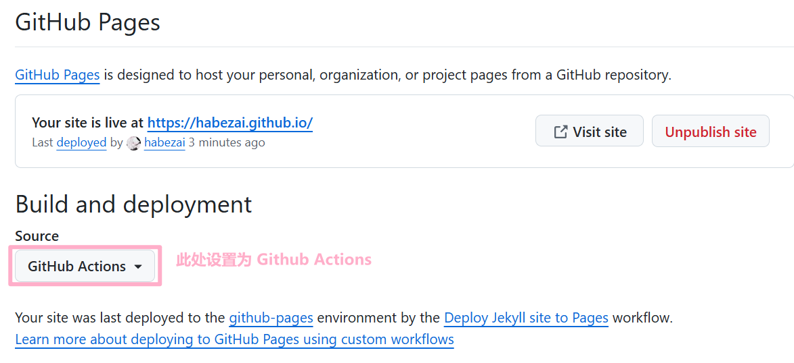

# just-the-docs
{: .no_toc }

## Table of contents
{: .no_toc .text-delta }

1. TOC
{:toc}

## 1.创建新站点
> To get started with creating a site, simply:
> 1.click ["use this template"](https://github.com/just-the-docs/just-the-docs-template/generate) to create a GitHub repository

点击链接，填写一个仓库名，然后点击Create即可。


## 2.发布新站点
> go to Settings > Pages > Build and deployment > Source, and select GitHub Actions




## 3.网站首页和配置修改

`index.md` 简单demo

```markdown
---
title: 首页
layout: home
---

正文替换为实际内容
```

`_config.yml` 除了主题固定采用just-the-docs，别的都可依据实际使用值进行自定义。

```markdown
title: Habezai's Knowledge Farm
description: A Knowledge Farm for Habezai!

theme: just-the-docs

url: https://habezai.github.io

aux_links:
  "本项目源码":
    - "https://github.com/habezai/habezai.github.io"  
  "在线演示":
    - "https://github.com/habezai"  
  "个人GitHub":
    - "https://github.com/habezai"  
```

## 4.在本地构建和预览站点
假设你已经安装了 [Jekyll](https://jekyllrb.com/) 和 [Bundler](https://bundler.io/)，


>安装
    1. [windows下安装Ruby(Ruby+DevKit )](https://rubyinstaller.org/downloads/)
    2. gem install jekyll bundler
    3.查看安装状态
        ruby -v
        jekyll -v
        bundler -v


- 修改你的工作目录到你的站点根目录。
- 执行 `bundle install`.
- 执行 `bundle exec jekyll serve` to build your site and preview it at `localhost:4000`.
- 构建好的内容会存在 `_site` 目录下。

## 5.在不同的平台上发布你构建的网站
只需要上传`_site`目录下的所有文件。
