# KeyNote-NF中文快速上手
{: .no_toc }

## Table of contents
{: .no_toc .text-delta }

<nav class="right-toc" markdown="1">
  1. 目录
  {:toc}
</nav>

## KeyNote-NF概述
KeyNote NF是一个功能强大的、标签式的Windows笔记本应用程序，它结合了丰富的**文本编辑**、**多级笔记组织**和强大的**加密**功能，以实现安全和灵活的知识管理。

KeyNote NF是由Daniel Prado Velasco开发的原始Tranglos KeyNote的改进，旨在增强笔记记录和个人知识管理。
它支持**Unicode编码**，允许用户处理多种语言的文档，并提供一个丰富的文本编辑器，用于格式化带有字体、颜色、要点、超链接和图像的笔记。
该程序是可移植的(portable)，不需要安装，并以**富文本格式（RTF）**存储所有笔记，直接进行备份和传输。

## KeyNote-NF关键特性
- 标签界面(Tabbed Interface)：同时在多个笔记上工作，提高组织和效率。
- 树形结构的笔记(Tree-Structured Notes)：组织信息与文件夹和子文件夹在一个单一的笔记。
- 富媒体支持(Rich Media Support)：在notes中嵌入图像或在外部存储图像，具有内部图像查看器，便于管理。
- 高级搜索(Advanced Search)：搜索所有笔记，包括子文件夹，为快速参考高亮的片段。
- 加密(Encryption)：支持Blowfish和IDEA加密，以确保敏感信息的专业人士。
- 宏和热键(Macros and Hotkeys)：自动化重复的任务和访问笔记，从任何应用程序专业人员快速访问。
- 节点管理(Node Management)：折叠、隐藏节点、镜像节点和复选框等功能允许灵活的组织和元数据标记。
- 导出选项(Export Options)：Notes可以导出为PDF或KeyNote格式，并支持压缩文件，以节省磁盘空间。
- 告警和提醒(Alarms and Reminders)：为任务管理设置节点告警。

KeyNote NF适用于个人知识管理、学术研究、项目规划、任务列表和专业文档。它将丰富的格式、层次化的组织和加密相结合，使其成为既需要灵活性又需要安全性的用户管理复杂信息的理想选择。

## 鼠标操作
> 鼠标右键可操作一切

### 1.新建同级Node
(更推荐方式：鼠标左键选中一个node，直接回车，新的同级Node自动创建)
选中某个Node，鼠标右键点击下图中的选项然后回车 
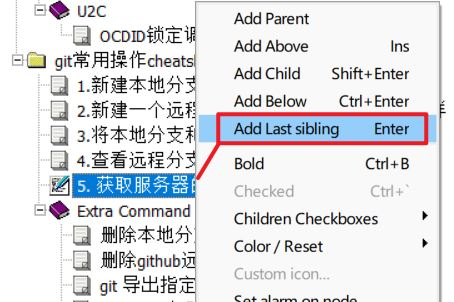
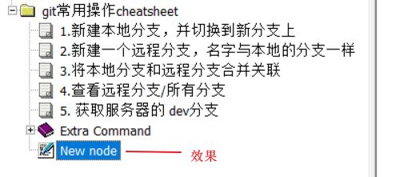

### 2.新建下级Node
(更推荐方式：鼠标左键选中一个node，直接Shift+回车，新的同级Node自动创建)
选中某个Node，鼠标右键点击下图中的选项然后回车
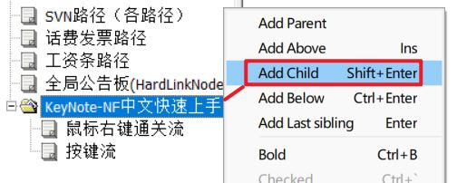
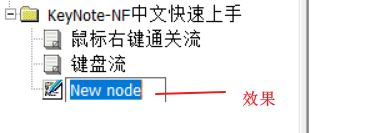

### 3.新建一个Tab界面
选中某个已经存在的NodeTab，鼠标右键点击下图中的选项然后回车
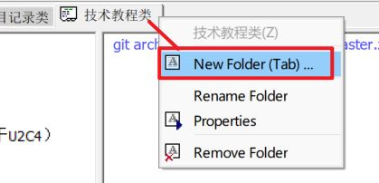
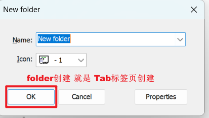
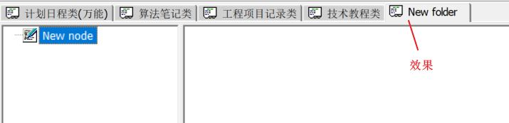

### 4.创建硬链接笔记(分身)
⦁	修改任何一个分身，所有的分身都会改变。
⦁	删除分身node，不会影响node内容（除非当前删除的是最后一个Link）。
⦁	教程：
	选中某个Node，鼠标右键点击下图中的选项然后回车
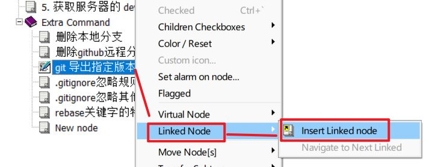
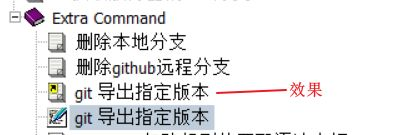

### 5.虚拟化磁盘文件(磁盘指针)
（使Node指向实际硬盘文本文件，对修改的保存会直接反映到绑定的文件）
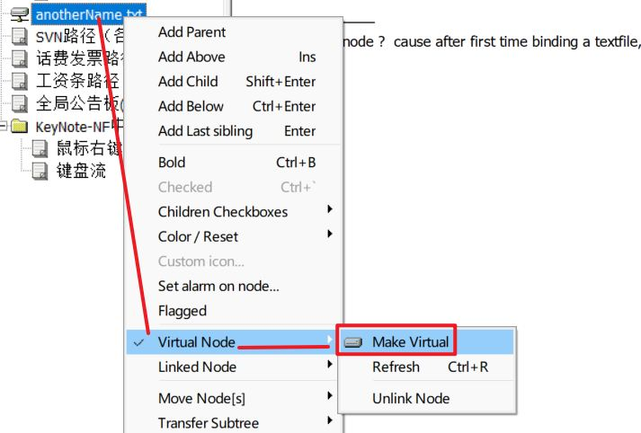
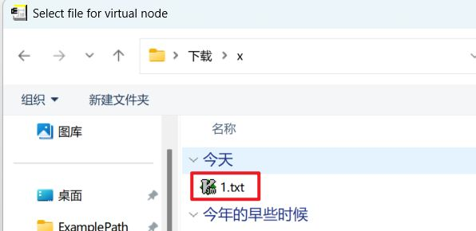

### 6.本Node内查找
（快捷键 Ctrl+F 可以直接调出 ）
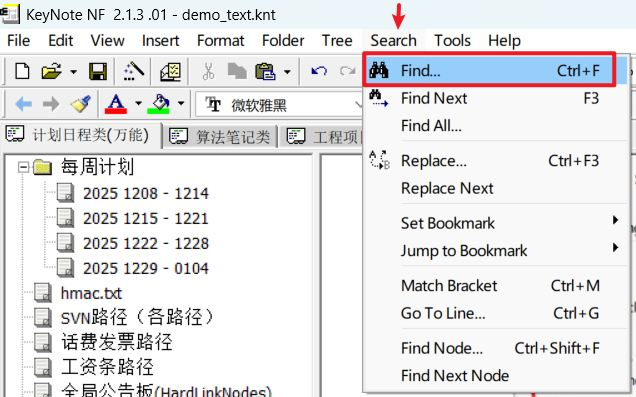

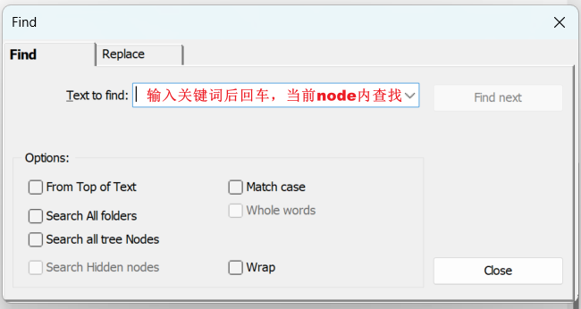

### 7.全局查找
（鼠标左键操作，按下图指示，所有的笔记Node均会参与查找）
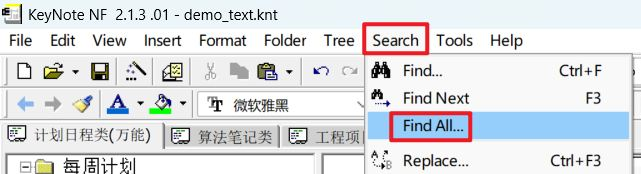
全局搜索的结果 出现在界面右侧，鼠标点击可直接跳转
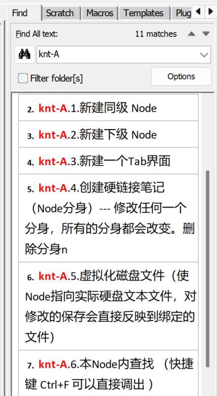

### 8.切换当前打开的knt工作文件
如下操作可以进入文件已打开列表，切换knt
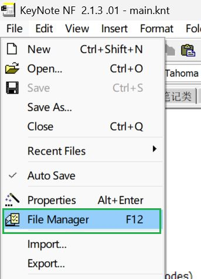
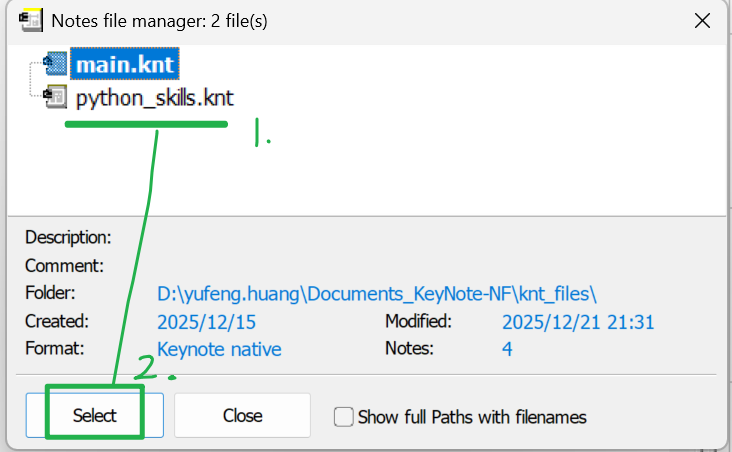
### 9.导入/并入另一个Knt文件
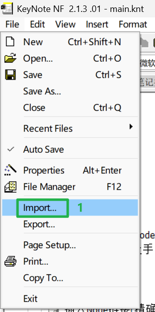
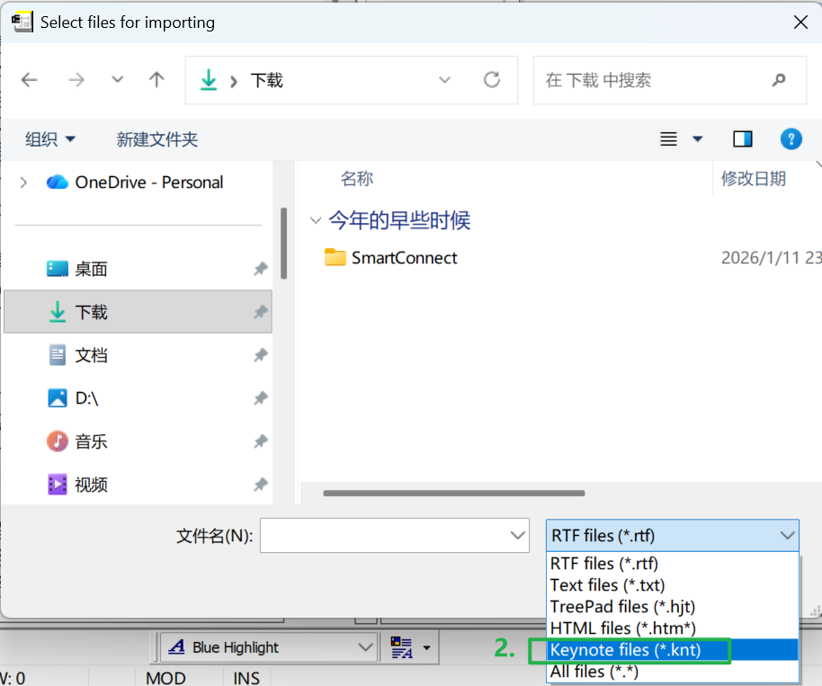
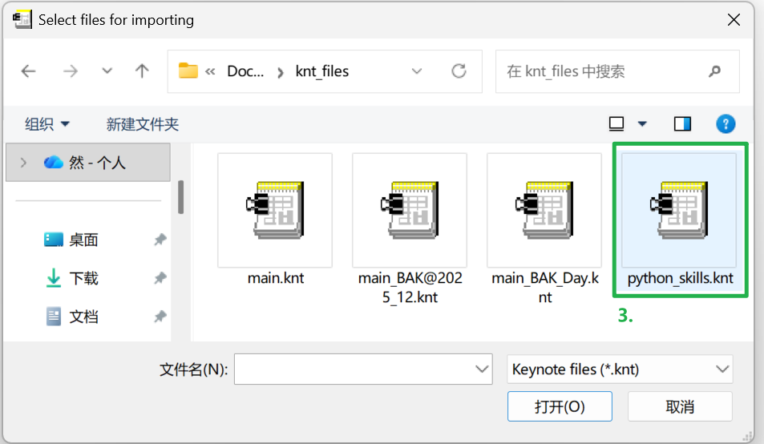
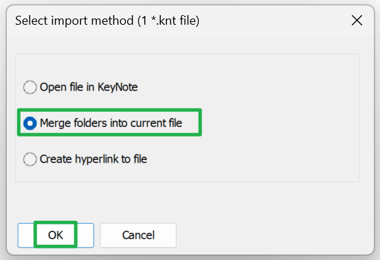  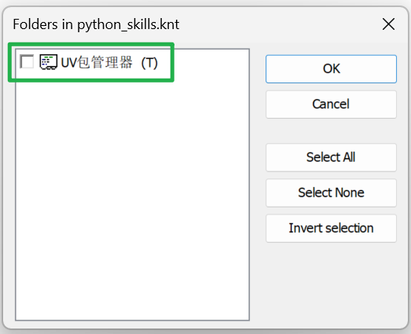
### 10.修改图片存储模式为外部存储
(注意：如果改为外部存储图片模式，对于加密文件，外部图片不会跟随文件加密)
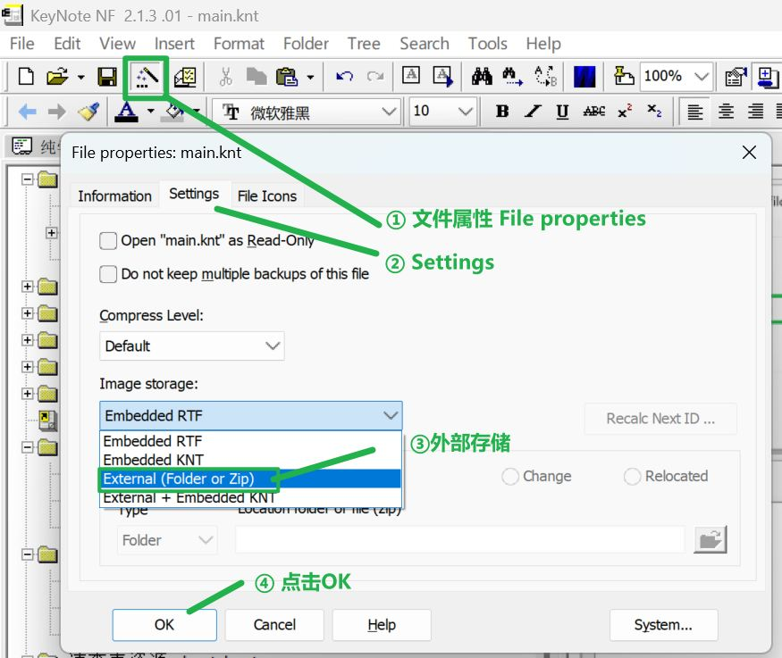
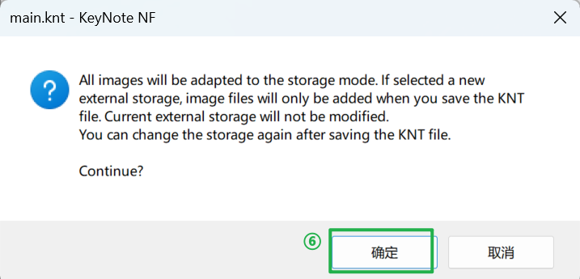
然后要手动点一下保存。

### 11.全局搜索的同时过滤显示Tree
搜索的同时，将Tree过滤(仅对当前 Folder生效 )，只显示关心的 node。

过滤后的效果：(仅对当前 Folder生效 )
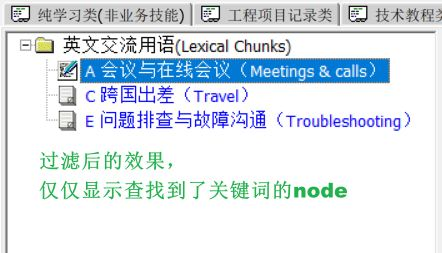

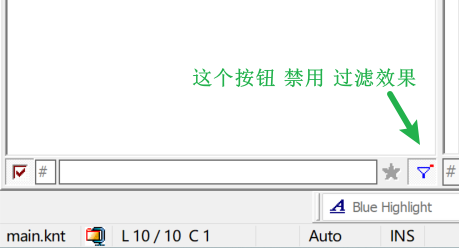

`禁用按钮---如果直接点击，则禁用。如果是 ctrl+点击，则会清除这个过滤效果`。

禁用过滤后的效果 (仅对当前 Folder生效 )
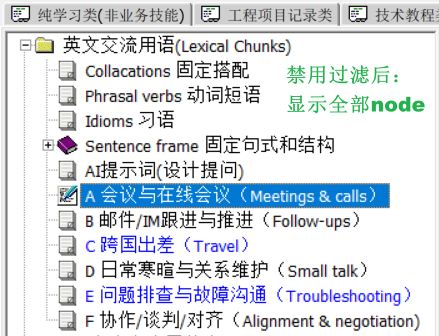

## 快捷键流
> 快捷键 Reference

### 设置只读模式

设置/恢复 当前Folder 只读模式 --- `Ctrl+Shift+R`

### 插入Node链接(精确位置)

鼠标左键点击，然后按快捷键以标记要被链接的 KeyNote位置 --- `Ctrl+F6`

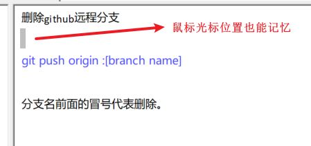

插入要链接的 KeyNote位置 --- `Shift+F6`
	效果（ 使用 Ctrl + 鼠标左键点击 即可跳转，Alt + ⬅ 即可回退位置）：

### 切换当前knt工作文件
快捷键F12，即呈现当前打开的文件列表。
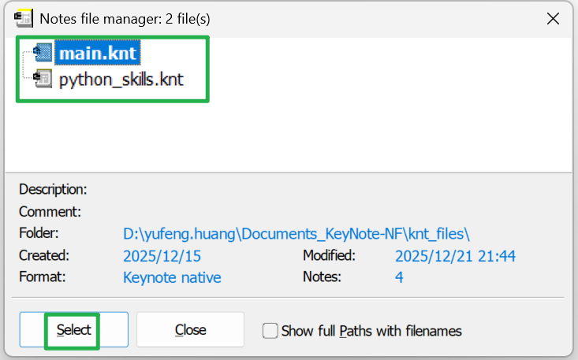

### Alt+左方向回退位置

### Alt+右方向前进位置

### Ctrl++,计算算术表达式
比如  345+111*2
第一步 选中

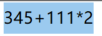
		
第二部 快捷键 Ctrl  +

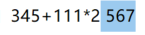

应用快捷键之前，可以添等号（处理过程中会自动忽略末尾等号）：
	比如  25 MOD 7  = 
	25 MOD 7  =  4

## 特色功能
### KNT文件加密设置
设置 knt 文件属性( 设置加密，压缩等配置 )  --- `Alt Enter`
 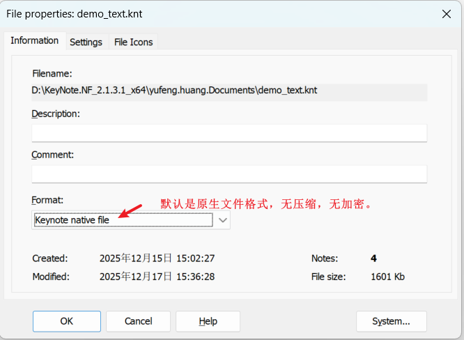
 
如果要设置 文件进行 加密，则按下图配置
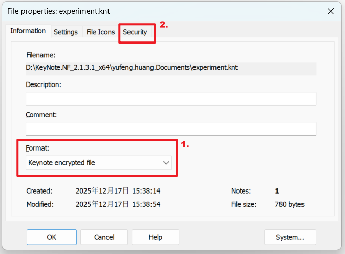

设置密码口令，这里我写的是一个简单密码，请勿模仿（这里完成以后，`Ctrl+S`保存当前KeyNote文件即加密生效）
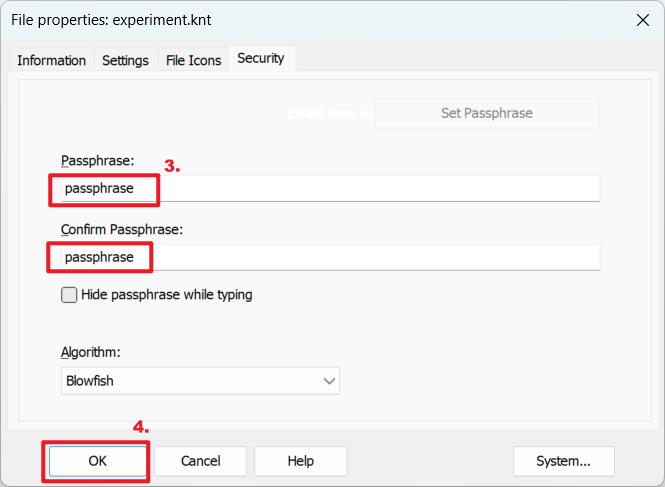
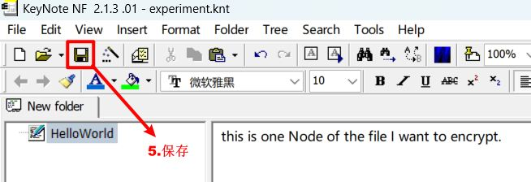

再次打开就要密码了。
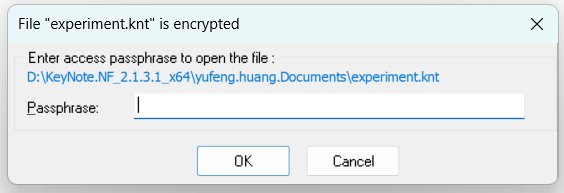

