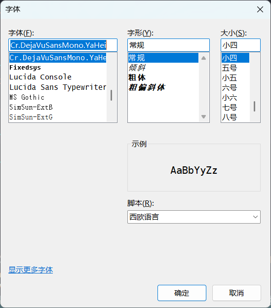

## Vim Cheat Sheet罗列
- [Vim Cheat Sheet](non-markdown/Vim_Cheat_Sheet.html)

## Vim 设置字体
- 通过命令行设置字体和大小
```bash
# 命令行模式 Linux/Unix: 
set guifont=Monospace\空格14  #注意这里需要对空格使用\进行转义
	
# 命令行模式 Windows: 
set guifont=Monospace:h14   #注意这里的字体大小需要有h的标识
```
- 通过GUI选择字体和大小（更直观）
```bash
# Windows或Linux/Unix：
set guifont=*
```
上述命令输入完毕后，GVIM将会弹出一个对话框，提示选择字体和大小，点击确认即可完成设置。



